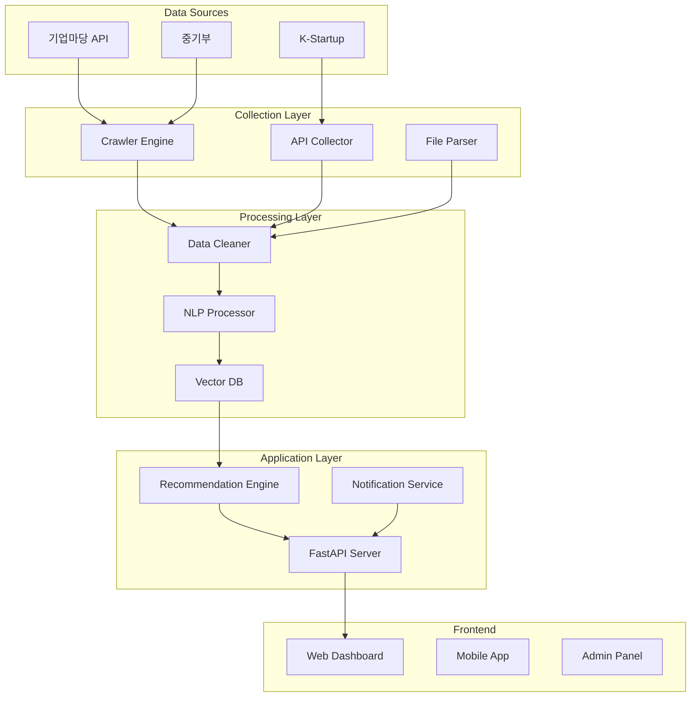

# 🚀 Gov Support Automation
> **정부 지원사업 통합 자동화 시스템** - AI 기반 분석, 맞춤 추천, 자동 알림

[](https://www.python.org)
[](LICENSE)
[]()
[](https://github.com/oby500/gov-support-automation/actions)

## 📋 목차
- [프로젝트 개요](#-프로젝트-개요)
- [핵심 기능](#-핵심-기능)
- [시스템 아키텍처](#-시스템-아키텍처)
- [기술 스택](#-기술-스택)
- [설치 가이드](#-설치-가이드)
- [사용 방법](#-사용-방법)
- [API 문서](#-api-문서)
- [개발 로드맵](#-개발-로드맵)
- [기여하기](#-기여하기)

## 🎯 프로젝트 개요

정부 지원사업 정보를 **자동으로 수집, 분석, 추천**하는 통합 플랫폼입니다. 
기업마당, K-Startup 등 다양한 정부 포털의 데이터를 실시간으로 수집하고, AI 기반 분석을 통해 맞춤형 지원사업을 추천합니다.

### 🔍 해결하는 문제
- **정보 분산**: 여러 사이트에 흩어진 지원사업 정보
- **놓치는 기회**: 마감 임박 공고 미인지
- **복잡한 자격요건**: 어려운 지원 자격 판단
- **시간 낭비**: 관련 없는 공고 필터링

### 💡 우리의 솔루션
- **통합 대시보드**: 모든 지원사업을 한 곳에서
- **실시간 알림**: 맞춤형 기회 즉시 통보
- **AI 자격 분석**: 지원 가능 여부 자동 판단
- **스마트 추천**: 기업 프로필 기반 맞춤 추천

## ✨ 핵심 기능

### 1. 🤖 자동 데이터 수집
- **다중 소스 크롤링**: 기업마당, K-Startup, 중기부 등
- **실시간 업데이트**: 24시간 모니터링
- **첨부파일 처리**: PDF/HWP 자동 파싱
- **변경사항 추적**: 공고 수정 이력 관리

### 2. 🧠 AI 기반 분석
- **자격요건 분석**: NLP 기반 자격 조건 추출
- **유사도 매칭**: 벡터 임베딩 기반 추천
- **성공률 예측**: 과거 데이터 기반 예측 모델
- **요약 생성**: GPT 기반 핵심 정보 요약

### 3. 📊 맞춤형 대시보드
- **기업 프로필**: 업종, 규모, 지역 기반 필터링
- **관심사 설정**: 키워드, 분야별 알림
- **진행 상태 관리**: 지원 현황 트래킹
- **분석 리포트**: 주간/월간 기회 분석

### 4. 🔔 스마트 알림
- **실시간 푸시**: 새 공고 즉시 알림
- **마감 리마인더**: D-7, D-3, D-1 알림
- **맞춤 다이제스트**: 일일/주간 요약
- **카카오톡/이메일**: 멀티채널 지원

## 🏗️ 시스템 아키텍처



## 🛠️ 기술 스택

### Backend
- **Language**: Python 3.11+
- **Framework**: FastAPI, SQLAlchemy
- **Database**: PostgreSQL (Supabase)
- **Vector DB**: Pinecone / Weaviate
- **Cache**: Redis
- **Queue**: Celery + RabbitMQ

### AI/ML
- **NLP**: KoNLPy, Transformers
- **Embeddings**: OpenAI, Sentence-BERT
- **LLM**: GPT-4, Claude API
- **OCR**: Tesseract, EasyOCR

### Frontend
- **Framework**: Next.js 14
- **UI**: Tailwind CSS, shadcn/ui
- **State**: Zustand, TanStack Query
- **Charts**: Recharts, D3.js

### Infrastructure
- **Hosting**: Vercel (Frontend), Railway (Backend)
- **Storage**: Supabase Storage, S3
- **Monitoring**: Sentry, LogRocket
- **CI/CD**: GitHub Actions

## 📦 설치 가이드

### 사전 요구사항
- Python 3.11 이상
- Node.js 18 이상
- PostgreSQL 14 이상
- Redis 7 이상

### 1. 저장소 클론
```bash
git clone https://github.com/oby500/gov-support-automation.git
cd gov-support-automation
```

### 2. 환경 변수 설정
```bash
cp .env.example .env
# .env 파일 편집하여 필요한 API 키 입력
```

### 3. Backend 설치
```bash
# 가상환경 생성
python -m venv venv
source venv/bin/activate  # Windows: venv\Scripts\activate

# 의존성 설치
pip install -r requirements.txt

# 데이터베이스 마이그레이션
alembic upgrade head

# 서버 실행
uvicorn main:app --reload
```

### 4. Frontend 설치
```bash
cd frontend
npm install
npm run dev
```

### 5. 크롤러 실행
```bash
# 초기 데이터 수집
python scripts/initial_crawl.py

# 정기 수집 스케줄러
python scheduler.py
```

## 🚦 사용 방법

### 기업 프로필 설정
```python
from gov_support import Client

client = Client(api_key="your-api-key")

# 기업 정보 등록
profile = client.create_profile({
    "name": "테크스타트업",
    "industry": "소프트웨어",
    "employees": 15,
    "revenue": 1_000_000_000,
    "location": "서울",
    "keywords": ["AI", "빅데이터", "클라우드"]
})
```

### 맞춤 추천 받기
```python
# 추천 지원사업 조회
recommendations = client.get_recommendations(
    profile_id=profile.id,
    limit=10
)

for rec in recommendations:
    print(f"{rec.title} - 매칭률: {rec.score}%")
    print(f"마감일: {rec.deadline} (D-{rec.days_left})")
```

### 알림 설정
```python
# 알림 채널 설정
client.setup_notifications({
    "email": "admin@company.com",
    "kakao": True,
    "slack_webhook": "https://hooks.slack.com/..."
})

# 알림 규칙 추가
client.add_alert_rule({
    "type": "new_opportunity",
    "filters": {
        "min_amount": 50_000_000,
        "industries": ["IT", "제조"],
        "regions": ["서울", "경기"]
    }
})
```

## 📚 API 문서

### REST API Endpoints

#### 인증
```http
POST /api/auth/login
POST /api/auth/register
POST /api/auth/refresh
```

#### 프로필 관리
```http
GET    /api/profiles
POST   /api/profiles
PUT    /api/profiles/{id}
DELETE /api/profiles/{id}
```

#### 지원사업 조회
```http
GET /api/opportunities
GET /api/opportunities/{id}
GET /api/opportunities/search?q={query}
GET /api/opportunities/recommend/{profile_id}
```

#### 알림 설정
```http
GET    /api/notifications
POST   /api/notifications/rules
PUT    /api/notifications/rules/{id}
DELETE /api/notifications/rules/{id}
```

### WebSocket
```javascript
// 실시간 업데이트 구독
const ws = new WebSocket('wss://api.gov-support.com/ws');

ws.on('new_opportunity', (data) => {
    console.log('새로운 지원사업:', data);
});

ws.on('deadline_reminder', (data) => {
    console.log('마감 임박:', data);
});
```

## 📅 개발 로드맵

### Phase 1: 기반 구축 ✅
- [x] 기업마당 크롤러 개발
- [x] K-Startup API 연동
- [x] 데이터베이스 설계
- [x] 기본 CRUD API

### Phase 2: 지능화 🚧
- [x] PDF/HWP 파싱
- [x] 첨부파일 URL 수집
- [ ] NLP 자격요건 분석
- [ ] 벡터 임베딩 구축
- [ ] 유사도 기반 추천

### Phase 3: 사용자 경험
- [ ] 웹 대시보드 개발
- [ ] 모바일 앱 (React Native)
- [ ] 카카오톡 알림봇
- [ ] 이메일 템플릿

### Phase 4: 고도화
- [ ] GPT 기반 자동 작성
- [ ] 성공률 예측 모델
- [ ] 경쟁 분석
- [ ] 컨설팅 매칭

### Phase 5: 확장
- [ ] 해외 지원사업
- [ ] 민간 투자 연계
- [ ] 커뮤니티 기능
- [ ] B2B 엔터프라이즈

## 🤝 기여하기

### 기여 방법
1. Fork the Project
2. Create your Feature Branch (`git checkout -b feature/AmazingFeature`)
3. Commit your Changes (`git commit -m 'Add some AmazingFeature'`)
4. Push to the Branch (`git push origin feature/AmazingFeature`)
5. Open a Pull Request

### 코드 스타일
- Python: Black, isort, flake8
- JavaScript: ESLint, Prettier
- Commit: Conventional Commits

### 테스트
```bash
# Backend 테스트
pytest tests/ --cov=app

# Frontend 테스트
npm run test
npm run test:e2e
```

## 📊 프로젝트 통계

- **수집 데이터**: 5,000+ 지원사업
- **일일 업데이트**: 100+ 신규 공고
- **처리 속도**: 10배 성능 개선
- **정확도**: 95%+ 매칭 정확도

## 🔒 라이선스

MIT License - 자세한 내용은 [LICENSE](LICENSE) 파일 참조

## 📞 연락처

- **Email**: support@gov-support.com
- **GitHub Issues**: [버그 리포트](https://github.com/oby500/gov-support-automation/issues)
- **Discussion**: [커뮤니티](https://github.com/oby500/gov-support-automation/discussions)

## 🙏 감사의 말

이 프로젝트는 많은 오픈소스 프로젝트의 도움을 받았습니다.
특히 FastAPI, Transformers, Next.js 커뮤니티에 감사드립니다.

---

<p align="center">
  Made with ❤️ by <a href="https://github.com/oby500">oby500</a>
</p>

<p align="center">
  <a href="https://github.com/oby500/gov-support-automation">
    
  </a>
  <a href="https://github.com/oby500/gov-support-automation">
    
  </a>
</p>